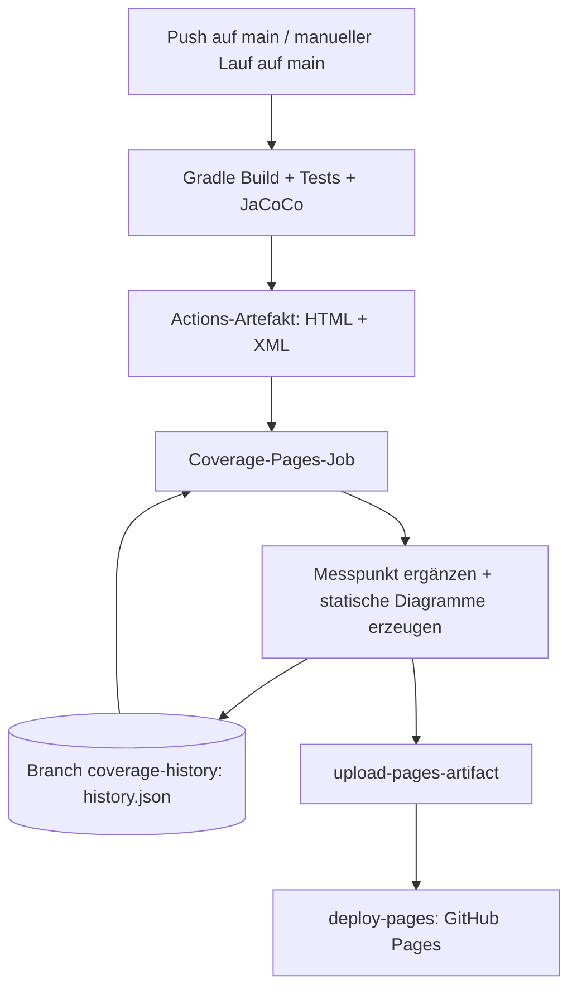

# Coverage-Verlauf – Auftrag 2 und 2.5

## Design (Auftrag 2)

Der bestehende CI-Workflow baut und testet das Projekt bei Pushes und Pull Requests.
JaCoCo erzeugt dabei einen HTML-Bericht und `build/reports/jacoco/test/jacocoTestReport.xml`.
Beide werden als Actions-Artefakt `jacoco-report` gespeichert.

Für erfolgreiche Builds auf `main` liest ein zusätzlicher Job die **aggregierten
INSTRUCTION- und BRANCH-Zähler** aus dem XML. Coverage wird als
`covered / (covered + missed) * 100` berechnet. Gibt es keine Branches, steht
der Wert auf `null` (angezeigt als `n/a`), nicht auf künstlichen 100 %.

Die Historie liegt dauerhaft im separaten Branch `coverage-history` unter
`coverage-history/history.json`. Sie ist damit unabhängig von der begrenzten
Aufbewahrungsdauer der Actions-Artefakte. Beispiel für einen Messpunkt:

```json
{
  "date": "2026-09-17T12:00:00+00:00",
  "commit": "0123456789abcdef0123456789abcdef01234567",
  "run_id": 123456789,
  "instruction": 72.4,
  "branch": 61.2
}
```

Vor jeder Aktualisierung lädt der Job diesen Branch. Beim ersten Lauf wird er
angelegt. Ein neuer Commit ergänzt einen Messpunkt; erneute Läufe desselben
Commits behalten den ursprünglichen Messpunkt. Sortierung nach Workflow-Run-ID,
UTC-Zeitpunkt als zusätzliche Information. Fehler beim Laden oder beim Lesen
der Historie brechen den Job ab, statt bestehende Daten zu überschreiben.

Ein Python-Skript ohne externe Abhängigkeiten erzeugt zwei SVG-Liniendiagramme
mit fester Skala von 0–100 %, Commit-Kürzeln, Tooltips und einer Wertetabelle.
Die Seite benötigt weder JavaScript noch einen externen Diagrammdienst.
Der aktuelle JaCoCo-HTML-Bericht ist ebenfalls verlinkt.



## Umsetzung und Einrichtung (Auftrag 2.5)

1. Änderungen in `main` übernehmen.
2. Im Repository **Settings → Pages → Build and deployment → Source → GitHub Actions** wählen.
3. **Actions → TicTacToe CI → Run workflow**, Branch `main`, starten oder auf `main` pushen.
4. Die veröffentlichte URL steht im Deployment des Environments `github-pages`.
   Für dieses Repository normalerweise:
   `https://philip222111.github.io/450-tictactest-mvk/coverage-history/index.html`.

Der Job benötigt `contents: write` zum Speichern der Historie sowie `pages: write`
und `id-token: write` für die offizielle Pages-Action. Repository-/Organisationsregeln
müssen den Bot in `coverage-history` schreiben lassen. Kein persönlicher Token nötig.
Der vorhandene Build-Container aus GHCR muss wie bisher verfügbar sein.

Nur erfolgreiche `main`-Builds veröffentlichen Messwerte. Andere Branches und PRs
liefern ausschließlich Berichtsartefakte. Der Historien-Branch ist vom Push-Trigger
ausgenommen. Der Pages-Job ist per Concurrency serialisiert; ein laufender Job wird
nicht abgebrochen. GitHub kann bei mehreren wartenden Jobs den älteren wartenden
Job ersetzen: Die Historie zeigt veröffentlichte erfolgreiche Messungen, nicht
zwingend jeden Commit bei sehr schnellen Push-Folgen. Ein ausgelassener Lauf kann
erneut gestartet werden. Die Historie beginnt mit dem ersten Lauf dieser Lösung;
frühere Commits werden nicht rückwirkend vermessen.

Die Veröffentlichung ersetzt den Inhalt der GitHub-Pages-Site dieses Repositorys.
Bei einem Deployment-Fehler bleibt die Historie im Branch erhalten; der Lauf kann
erneut gestartet werden. `coverage-history` nicht löschen, da dort die Historie liegt.

## Lokal prüfen

```sh
bash gradlew build
python3 -m unittest discover -s scripts -p 'test_*.py'
COVERAGE_COMMIT=$(git rev-parse HEAD) COVERAGE_RUN=1 python3 scripts/coverage_history.py \
  build/reports/jacoco/test/jacocoTestReport.xml build/coverage-site
```

Der generierte Verlauf liegt unter `build/coverage-site/coverage-history/index.html`.
Der Workflow kopiert zusätzlich den HTML-Detailbericht nach `report/`.

## Recherchierte Werkzeuge

- [Gradle JaCoCo Plugin](https://docs.gradle.org/current/userguide/jacoco_plugin.html):
  native Integration für Tests und XML-/HTML-Berichte.
- [JaCoCo-Versionen](https://www.jacoco.org/jacoco/trunk/doc/changes.html):
  Version 0.8.15 unterstützt die verwendete Java-Version 25.
- [Offizielle GitHub-Pages-Workflows](https://docs.github.com/en/pages/getting-started-with-github-pages/using-custom-workflows-with-github-pages):
  `configure-pages`, `upload-pages-artifact` und `deploy-pages` übernehmen die Veröffentlichung.
- [deploy-pages](https://github.com/actions/deploy-pages): Berechtigungen und Environment-Konfiguration.

Für die zwei Metriken genügt ein kleines Skript mit Standardbibliothek; ein
zusätzlicher ReportGenerator ist daher nicht erforderlich. Auftrag 3 (PR-Coverage-Gate)
ist nicht Teil dieser Umsetzung.
